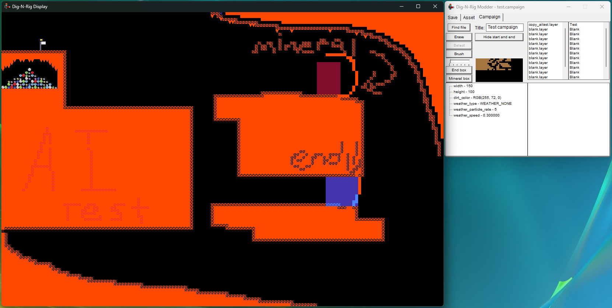

# Dig-N-Rig Modder
Level and asset creator for the DigiPen student project Dig-N-Rig.
## Images

---
I am not working on this editor anymore. But, generally speaking, you could make a fully new campaign out of this. All it needs is a binary mode for the campaign creator, the ability to change music on each layer, and changing toughness of the rocks based on layer. Shouldn't be too hard--I just got sick of it.